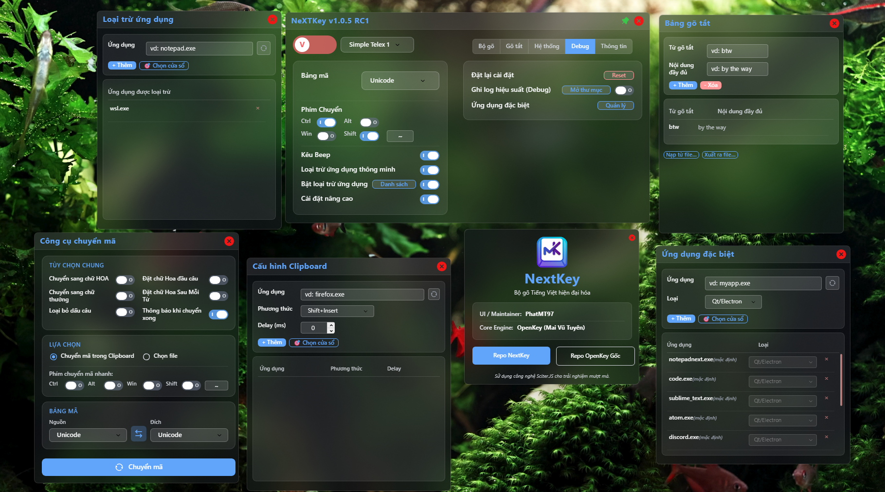

# NextKey - Bộ gõ Tiếng Việt hiện đại cho Windows

  
  

<em>Giao diện NextKey: Chế độ compact (trái) và mở rộng với Advanced Settings (phải)</em>

  

<em>Toàn bộ giao diện NextKey</em>

## 💡 Về NextKey

**NextKey** là bộ gõ tiếng Việt mã nguồn mở, được phát triển dựa trên nền tảng [OpenKey](https://github.com/tuyenvm/OpenKey) của tác giả Mai Vũ Tuyên. Sau thời gian dài phát triển, NextKey đã trở thành một sản phẩm độc lập với:

- 🎨 **Giao diện hoàn toàn mới** - Thiết kế Glassmorphism hiện đại
- ⚡ **Engine được tối ưu sâu** - Xử lý nhanh, mượt mà trên mọi ứng dụng
- 🛡️ **Nhiều tính năng mới** - Loại trừ ứng dụng, Special Apps, Convert Tool...
- 🐛 **Sửa nhiều lỗi quan trọng** - PowerPoint, Lock Screen, Qt/Electron apps...
- 🔄 **Cập nhật thường xuyên** - Hỗ trợ tích cực từ cộng đồng

> **Ghi nhận:** NextKey được xây dựng trên nền tảng OpenKey. Nếu bạn muốn ủng hộ tác giả gốc: [Donate cho Mai Vũ Tuyên](https://tuyenvm.github.io/donate.html)

---

## 🔒 Cam kết Quyền riêng tư (Privacy)

NextKey cam kết **tôn trọng tuyệt đối quyền riêng tư** của người dùng:
- ✅ **Không** thu thập dữ liệu gõ phím (Keylog).
- ✅ **Không** gửi dữ liệu cá nhân về máy chủ.
- ✅ **Không** chứa phần mềm độc hại hoặc quảng cáo.
- Toàn bộ mã nguồn được công khai minh bạch (Open Source) để cộng đồng kiểm chứng.

---

## ✨ Điểm nổi bật của NextKey

### 🎨 Giao diện NextKey (Modern UI with Glassmorphism)

- **Glassmorphism Design**: Hiệu ứng kính mờ với độ trong suốt tinh tế
- **Pastel Color Palette**: Bảng màu nhẹ nhàng, dễ nhìn
- **Modern Toggle Switches**: Công tắc kiểu iOS với animation mượt mà
- **Tab Navigation**: Phân chia cài đặt: Bộ gõ, Gõ tắt, Hệ thống, Thông tin
- **Real-time V/E Toggle**: Đồng bộ trạng thái Anh/Việt realtime

> 🎨 Được xây dựng trên nền tảng **Sciter** - HTML/CSS rendering engine nhẹ và nhanh.

### 🛡️ Loại trừ ứng dụng (English Only Mode)

Cực kỳ hữu ích cho lập trình viên và game thủ:
- Lập danh sách ứng dụng "loại trừ" (VSCode, Terminal, CS:GO...)
- Tự động chuyển sang English và khóa phím tắt khi focus vào ứng dụng trong danh sách
- Dropdown gợi ý từ danh sách ứng dụng đang chạy

### ⚡ Hiệu năng vượt trội

- 🚀 **Tối ưu chế độ English**: Giảm tải CPU tối đa
- 🎯 **Fix lag Qt/Electron apps**: VSCode, Discord, NotepadNext... hoạt động mượt mà
- 🔍 **Tra cứu nhanh**: Phản hồi tức thì khi gõ tiếng Việt
- ⌨️ **Xử lý phím tắt mượt**: Ctrl+C, Alt+Tab... không bị delay

> 👉 Chi tiết: [OPTIMIZATION_DETAILS.md](Docs/OPTIMIZATION_DETAILS.md)

### 🔧 Sửa lỗi quan trọng

| Vấn đề | Trạng thái | Chi tiết |
|--------|-----------|----------|
| Không gõ được trong PowerPoint | ✅ Fixed | [POWERPOINT_FIX.md](Docs/POWERPOINT_FIX.md) |
| Phím tắt hỏng sau Lock Screen | ✅ Fixed | [LOCK_SCREEN_FIX.md](Docs/LOCK_SCREEN_FIX.md) |
| Lỗi Backspace | ✅ Fixed | [BACKSPACE_BUG_FIX.md](Docs/BACKSPACE_BUG_FIX.md) |
| Startup lỗi với đường dẫn có Space | ✅ Fixed | - |

### 🎯 Icon sắc nét trên High DPI

- **Multi-resolution icons**: 16, 20, 24, 32, 48, 64, 128, 256px
- **LoadIconMetric API**: Tự động chọn kích thước phù hợp với DPI
- **Font Arial Rounded MT Bold**: Chữ V/E sắc nét ở mọi kích thước

---

## ⌨️ Tính năng gõ tiếng Việt

### Hỗ trợ gõ
- **Kiểu gõ**: Telex, VNI, Simple Telex 1/2
- **Bảng mã**: Unicode (Dựng sẵn), TCVN3, VNI Windows, Unicode tổ hợp...

### Tính năng thông minh
- **Modern Orthography**: Đặt dấu oà, uý (mới) hoặc òa, úy (cũ)
- **Smart Switch Key**: Ghi nhớ chế độ gõ cho từng ứng dụng
- **Kiểm tra chính tả**: Phát hiện và xử lý lỗi cơ bản
- **Macro (Gõ tắt)**: Không giới hạn ký tự
- **Quick Telex**: cc=ch, gg=gi, kk=kh...
- **Phục hồi từ sai**: Tự động khôi phục nếu từ không hợp lệ

### Tiện ích
- **Special Apps**: Cấu hình riêng cho từng ứng dụng (Qt/Electron, Skip IME check...)
- **Convert Tool**: Chuyển đổi văn bản giữa các bảng mã
- **Tự động cập nhật**: Kiểm tra phiên bản mới

---

## 📥 Cài đặt & Sử dụng

1. Tải về phiên bản mới nhất từ **Releases**
2. Giải nén và chạy `NextKey.exe`
3. (Khuyên dùng) Tắt các bộ gõ khác (Unikey, EVKey...) để tránh xung đột

## ❓ FAQ - Câu hỏi thường gặp

Gặp vấn đề khi sử dụng? Xem [FAQ](Docs/FAQ.md) để tìm giải pháp:
- Lỗi gõ tiếng Việt trên Notepad Windows 11
- Lỗi PowerPoint không nhận tiếng Việt
- Lag khi chuyển ứng dụng
- Config clipboard cho các case đặc biệt

---

## 📜 Mã nguồn & Giấy phép

Mã nguồn mở công khai dưới giấy phép **GPL**. Bạn có thể tự do tải về, nghiên cứu và phát triển tiếp, miễn là tuân thủ các điều khoản của giấy phép nguồn mở.
